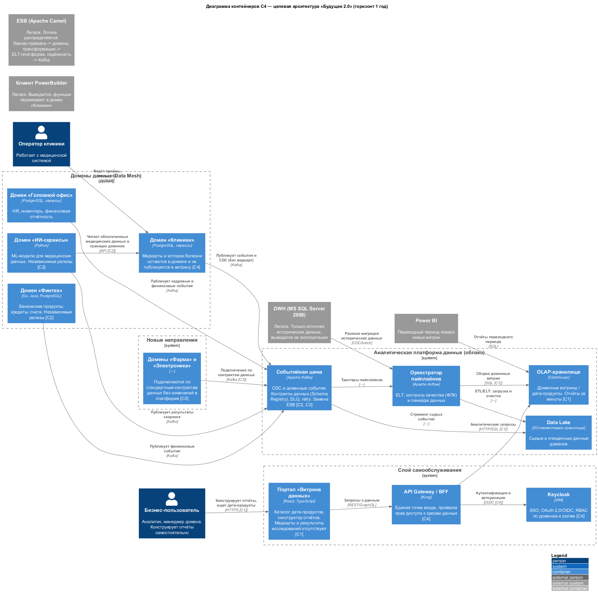

# Task 1. Целевая архитектура и приоритизация проблем «Будущее 2.0»

## 1. Диаграмма контейнеров C4 (горизонт 1 год)

Целевая архитектура отказывается от монолитного DWH как центра бизнес-логики. Данные разделяются по доменам (Data Mesh), публикуются в виде дата-продуктов через событийную шину и собираются в облачную аналитическую платформу. Медицинские карты, истории болезней и результаты исследований остаются в домене «Клиники» и не попадают в «Витрину данных».

Исходник: [diagrams/c4-containers.puml](diagrams/c4-containers.puml)

### Ключевые бизнес-сценарии на диаграмме

| Обозначение | Сценарий | Как поддерживается целевой архитектурой |
|-------------|----------|------------------------------------------|
| **С1** | Быстрая подготовка отчётности | Портал самообслуживания + ClickHouse (OLAP) + доменные витрины: отчёты строятся за минуты вместо часов. |
| **С2** | Независимое развитие финтех- и ИИ-направлений | Каждое направление — отдельный домен со своими сервисами, БД и релизным циклом; интеграция через Kafka, логика не возвращается в DWH. |
| **С3** | Масштабирование под новые бизнесы (фарма, электроника) | Новые домены подключаются по стандартным контрактам данных к событийной шине; платформа не меняется. |
| **С4** | Информационная безопасность и регуляторика | Keycloak обеспечивает SSO, OAuth 2.0/OIDC и RBAC; медицинские данные изолированы в домене клиник и не публикуются в витрину. |

### 1.1. Распределение логики ESB в целевой архитектуре

ESB (Apache Camel) сегодня — это не только транспорт: в шине сосредоточены форматно-логический контроль (ФЛК), пакетные и потоковые трансформации, паттерны надёжности и часть интеграционной/бизнес-логики. При замене ESB на событийную шину эта логика не исчезает, а явно распределяется между целевыми сервисами:

| Функция ESB (Apache Camel) сегодня | Куда переезжает в целевой архитектуре | Как реализуется |
|------------------------------------|----------------------------------------|-----------------|
| **ФЛК** (форматно-логический контроль сообщений) | Платформенный слой: событийная шина Kafka + Schema Registry; контроль качества — Airflow | Контракты данных (Avro/Protobuf-схемы), валидация на продюсере и консьюмере, data quality checks в пайплайнах |
| **Пакетные трансформации** (batch) | Аналитическая платформа: Airflow + Data Lake + ClickHouse | ELT-пайплайны: сырые данные в S3, SQL/dbt-трансформации при сборке доменных витрин |
| **Потоковые трансформации** (streaming) | Событийная шина: Kafka Streams / консьюмеры доменов | Стримовая обработка событий, обогащение и маршрутизация в доменные топики |
| **Паттерны надёжности** (retry, DLQ, идемпотентность, circuit breaker) | Kafka (DLQ-топики, семантика доставки) + доменные сервисы | DLQ-топики, retry с backoff, идемпотентные консьюмеры; circuit breaker — в сервисах доменов |
| **Интеграционная логика** (маршрутизация, маппинги справочников) | Доменные сервисы + стандартные контракты данных | Домены сами публикуют дата-продукты по контрактам; централизованный роутинг упраздняется |
| **Бизнес-логика, «зашитая» в шину** | Доменные сервисы (Клиники, Финтех, ИИ, Головной офис) | Правила переезжают во владения доменов — туда же, где живут данные; в платформу и DWH не возвращаются |

Ключевой принцип: ESB исчезает как отдельный компонент, но её функции сохраняются — транспорт уходит в Kafka, трансформации данных — в ELT-платформу, бизнес-правила — в доменные сервисы, надёжность — в платформенные механизмы шины.

---

## 2. Таблица проблемных мест

| № | Проблемное место | Суть проблемы | Затронутые сценарии | Последствие для бизнеса |
|---|------------------|---------------|---------------------|--------------------------|
| 1 | **DWH MS SQL Server 2008 как монолит с бизнес-логикой** | Все трансформации, отчёты и интеграции завязаны на устаревшем хранилище; любое изменение требует правок в DWH. | С1, С2 | Отчёты строятся часами, задерживаются управленческие решения; низкий time-to-market для новых продуктов. |
| 2 | **PowerBuilder-клиент клиники** | Устаревший клиент, дефицит специалистов, сложное сопровождение. | С4, частично С1 | Операционные риски в клиниках, дорогая поддержка, замедление цифровизации. |
| 3 | **ESB Apache Camel как централизованная шина** | Точка отказа и узкое горло; интеграции ведутся point-to-point, новый сервис подключается долго. В шине сосредоточены ФЛК, трансформации и интеграционная логика — при замене они распределяются между доменами и платформой (п. 1.1). | С2, С3 | Медленная интеграция новых бизнес-направлений; зависимость релизов от шины. |
| 4 | **BI-система (Power BI) с кастомизациями поверх DWH** | Аналитика заточена под структуру DWH; нет self-service, очереди на отчёты к ИТ. | С1 | Рост операционных издержек, ошибки в отчётах, невозможность быстро проверить гипотезу. |
| 5 | **Медицинские и финансовые данные в одном DWH без доменного разделения** | Перемешивание чувствительных данных; сложно применить разные политики доступа. | С4 | Риски ИБ и несоответствия требованиям регуляторов (банковская лицензия, медицинские данные). |
| 6 | **Отсутствие единого IAM и RBAC для данных** | Нет централизованного управления доступом к срезам данных; self-service невозможен безопасно. | С1, С4 | Блокирует портал самообслуживания, угроза утечек данных. |
| 7 | **On-prem инфраструктура без эластичного масштабирования** | Сотни терабайт данных, рост нагрузки ведёт к деградации, капекс на железо высокий. | С1, С3 | Невозможность быстро масштабироваться под новые направления и пики нагрузки. |
| 8 | **Финтех- и ИИ-логика «зашита» в DWH/ESB** | Направления не могут развиваться автономно, конфликтуют релизные циклы. | С2 | Замедление вывода банковских и ИИ-продуктов, рост технического долга. |

---

## 3. Приоритизация проблем

### 3.1. MoSCoW

| Группа | Проблемы | Обоснование |
|--------|----------|-------------|
| **Must** | 1 (декомпозиция DWH/вынос логики), 5 (разделение мед/фин данных), 6 (IAM/RBAC), запуск портала самообслуживания | Критично для выручки и управленческих решений, а также для соответствия регуляторике. Без этого витрина данных не может быть безопасно запущена. |
| **Should** | 3 (замена ESB на Kafka с распределением логики шины между доменами и платформой, п. 1.1), 7 (миграция в облако), 2 (вывод PowerBuilder) | Сильно влияют на time-to-market и стоимость владения, но могут идти параллельно итерациями. |
| **Could** | Полный отказ от Power BI в пользу портала, внедрение Data Catalog, расширенный data quality | Улучшают UX и governance, но не блокируют запуск MVP витрины. |
| **Won't (этот год)** | Полный вывод DWH из эксплуатации, переписывание всех финтех/ИИ-сервисов | DWH остаётся источником исторических данных на переходный период; сервисы эволюционируют доменами, а не «big bang». |

### 3.2. Матрица Эйзенхауэра

| | **Срочное** | **Несрочное** |
|---|-------------|---------------|
| **Важное** | **Сделать сейчас:** • Проблема 1 — декомпозиция DWH и вынесение логики (отчётность, time-to-market). • Проблема 5 — разделение медицинских и финансовых данных (регуляторика, риски). • Проблема 6 — IAM/RBAC для self-service (безопасность). | **Запланировать:** • Проблема 3 — замена ESB на событийную шину (независимость доменов). • Проблема 7 — миграция в облако (масштабируемость). • Проблема 2 — вывод PowerBuilder (стоимость владения). |
| **Неважное** | **Делегировать/отказаться:** • Косметические доработки и новые кастомизации Power BI поверх DWH. | **Отложить/не делать:** • Полный редизайн всех легаси-интерфейсов за пределами MVP. • «Идеальная» Data Mesh-витрина с zero technical debt. |

### 3.3. Связь с целями бизнеса

| Цель бизнеса | Проблемы | Приоритет |
|--------------|----------|-----------|
| Сократить time-to-market новых продуктов | 1, 3, 8 | Must / важное+срочное |
| Ускорить принятие управленческих решений | 1, 4 | Must |
| Обеспечить соответствие регуляторике (медицина + финансы) | 5, 6 | Must |
| Масштабироваться под новые бизнес-направления | 3, 7 | Should / важное+несрочное |
| Снизить стоимость владения легаси | 2, 7 | Should |

---

## 4. Краткий вывод

Целевая архитектура решает главный конфликт текущего ландшафта: монолитный DWH больше не является центром бизнес-логики. Вместо этого появляется облачная аналитическая платформа с доменными витринами, а прикладные направления развиваются автономно. На первый год критично сделать декомпозицию данных, IAM/RBAC и запустить портал самообслуживания — это открывает путь к остальным изменениям.
