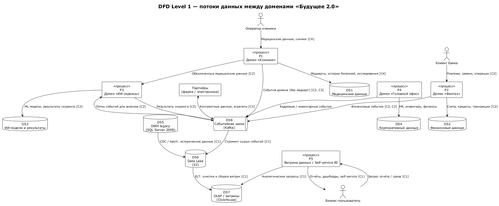

# Task 2. Разделение системы на домены и моделирование потоков данных

## 1. Домены данных (Data Mesh)

Домены выделены по бизнес-возможностям, а не по техническим слоям. Каждый домен владеет своими данными, публикует дата-продукты и развивается независимо — без внесения новой логики в DWH.

| Домен | Граница (bounded context) | Основные данные | Публикуемые дата-продукты |
|-------|---------------------------|-----------------|---------------------------|
| **Домен «Клиники»** | Операционная деятельность клиник | Медицинские карты, истории болезней, результаты исследований, приёмы, снимки | Операционные события домена **без медкарт и результатов исследований**; справочники пациентов/услуг |
| **Домен «Финтех»** | Банковские продукты | Счета, кредиты, транзакции, платежи, заявки | Финансовые события, агрегаты по счетам/кредитам, риск-метрики |
| **Домен «ИИ-сервисы»** | ML-диагностика и скоринг | ML-модели, результаты скоринга, размеченные датасеты | Результаты скоринга, прогнозы, события для клиник |
| **Домен «Головной офис»** | Внутреннее управление компанией | HR, инвентаризация, внутренняя финансовая отчётность | Кадровые и инвентарные события, финансовые агрегаты |
| **Домен «Витрина данных / Self-service BI»** | Аналитика и самообслуживание | Доменные витрины, дашборды, отчёты | Готовые срезы, дата-продукты для бизнес-пользователей |
| **Домен «Платформа данных»** | Инфраструктура интеграции и аналитики | Kafka, Data Lake, ClickHouse, Airflow | Потоки событий, витрины, ELT-пайплайны |
| **Домены партнёров** | Фармацевтика, производитель медицинской электроники | Данные партнёров | Контрактные данные и агрегаты по стандартным интерфейсам |

---

## 2. DFD Level 1 — потоки данных между доменами

Исходник: [diagrams/dfd-level1.puml](diagrams/dfd-level1.puml)

### Ключевые бизнес-сценарии на DFD

| Сценарий | Потоки данных | Почему это работает без DWH |
|----------|---------------|-----------------------------|
| **C1 — Быстрая подготовка отчётности** | `DWH legacy → Data Lake → ClickHouse → Витрина данных → Бизнес-пользователь` | Витрины собираются ELT-пайплайнами в ClickHouse; бизнес-пользователь запрашивает срезы напрямую, не обращаясь к DWH. |
| **C2 — Независимое развитие финтех- и ИИ-направлений** | `Домен «Клиники» → Kafka → Домен «ИИ-сервисы»` (обезличенные данные); `Домен «Финтех» → Kafka; ИИ-сервисы → Kafka` | Домены публикуют события в Kafka и читают нужные им потоки. Логика не зашивается в DWH, каждый домен релизит самостоятельно. |
| **C3 — Масштабирование под новые бизнесы (фарма, электроника)** | `Партнёры ↔ Kafka` | Новый партнёр подключается к событийной шине по контракту данных; платформа и существующие домены не меняются. |
| **C4 — Безопасность и регуляторика** | `Медицинские данные остаются в DS1 (Медицинские данные)`; в Kafka попадают только события без медкарт/исследований | Жёсткая граница домена «Клиники» не позволяет чувствительным данным попасть в витрину. |

---

## 3. Обоснование разделения на домены

### 3.1. Почему домены именно такие

- **Клиники, Финтех, ИИ, Головной офис** — это самостоятельные бизнес-направления с разными релизными циклами, командами и регуляторными требованиями. Объединять их в одном DWH означает конфликтовать за ресурсы и замедлять друг друга.
- **Витрина данных** выделена в отдельный домен, потому что она не является источником данных, а потребляет дата-продукты. Это предотвращает возвращение аналитической логики в DWH.
- **Платформа данных** — общий инфраструктурный домен (Kafka, Lake, ClickHouse, Airflow), который предоставляет «дороги», но не владеет бизнес-логикой.
- **Партнёры** подключаются как внешние домены через стандартные контракты, что позволяет масштабироваться без переписывания ядра.

### 3.2. Как это устраняет проблемы текущего ландшафта

| Проблема из Task1 | Как разделение на домены решает |
|-------------------|---------------------------------|
| Бизнес-логика в DWH | Логика живёт в доменных сервисах. DWH становится только источником исторических данных для миграции. |
| Зависимость финтех/ИИ от DWH | Финтех и ИИ публикуют/читают события через Kafka, развиваются автономно. |
| Медицинские и финансовые данные в одном хранилище | Границы доменов изолируют чувствительные данные и политики доступа. |
| Сложность подключения новых бизнесов | Новый домен подключается по контракту к Kafka, не затрагивая остальные системы. |
| Отсутствие self-service | Домен «Витрина данных» предоставляет готовые дата-продукты и конструктор отчётов. |

### 3.3. Преимущества для бизнеса

1. **Ускорение вывода продуктов**. Каждая команда может релизить свой домен независимо. Финтех-продукт не ждёт релиза DWH.
2. **Снижение зависимости от DWH**. DWH перестаёт быть «бутылочным горлышком». Новая логика не попадает в него, а исторические данные мигрируют в Data Lake.
3. **Возможность отдельного развития направлений**. У клиник, финтеха и ИИ разные скорость изменений, команды и регуляторика. Доменная граница защищает каждое направление от изменений соседей.
4. **Масштабирование через партнёров**. Подключение фармы или производителя электроники сводится к согласованию контракта данных и интеграции с Kafka, а не к доработке DWH.
5. **Соответствие требованиям ИБ и регуляторики**. Медицинские данные остаются в домене клиник; финансовые — в финтехе. RBAC применяется на уровне дата-продуктов и потоков.

---

## 4. Краткий вывод

Разделение на домены строится вокруг бизнес-возможностей, а не технологий. Событийная шина Kafka становится стандартным способом интеграции, а DWH постепенно выводится из роли «центра всей логики». Это позволяет финтеху и ИИ развиваться независимо, безопасно подключать новых партнёров и масштабировать отчётность на витрине данных.
