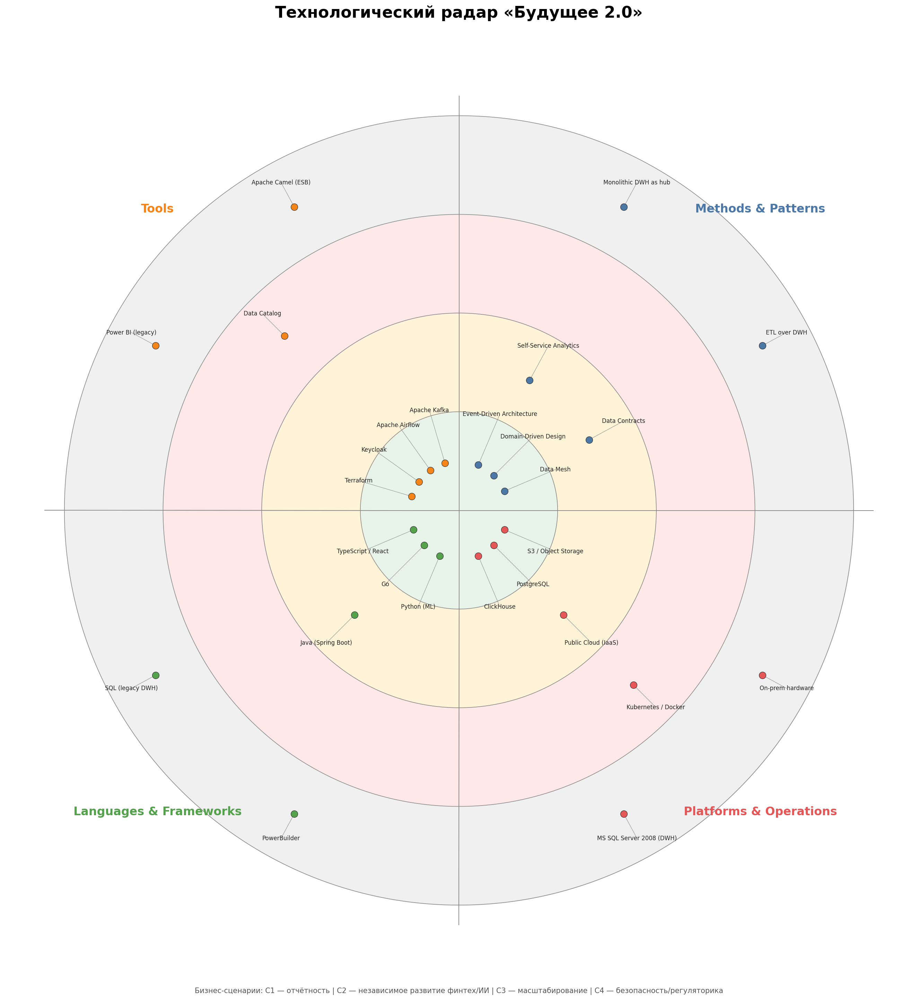
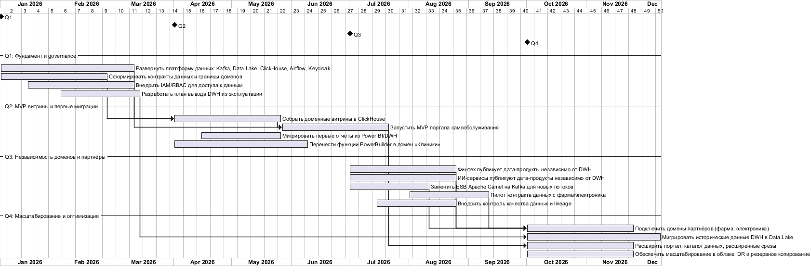

# Task 3. Технологический радар и роадмап изменений «Будущее 2.0»

## 1. Технологический радар

SVG-версия: [tech-radar.svg](tech-radar.svg)

### Условные обозначения

- **Adopt** — использовать как стандарт.
- **Trial** — пилотируем на ограниченном скоупе.
- **Assess** — изучаем, не используем в проде.
- **Hold** — отказываемся / выводим.

Бизнес-сценарии: **C1** — быстрая отчётность; **C2** — независимое развитие финтех/ИИ; **C3** — масштабирование под новые бизнесы; **C4** — безопасность и регуляторика.

### Таблица технологий

| Кольцо | Технология | Квадрант | Сценарии | Обоснование |
|--------|------------|----------|----------|-------------|
| **Adopt** | Data Mesh | Methods & Patterns | C2, C3 | Снимает зависимость от DWH, позволяет независимо развивать домены и подключать партнёров. |
| **Adopt** | Domain-Driven Design | Methods & Patterns | C2, C3 | Дает понятные границы доменов и единый язык команд. |
| **Adopt** | Event-Driven Architecture | Methods & Patterns | C2, C3 | Заменяет ESB-связанность на асинхронные события, ускоряет интеграцию. |
| **Adopt** | Apache Kafka | Tools | C2, C3 | Событийная шина для всех доменов; новый сервис подключается по контракту. |
| **Adopt** | Apache Airflow | Tools | C1 | Оркестрация ELT-пайплайнов и контроль качества данных. |
| **Adopt** | Keycloak | Tools | C4 | SSO, OAuth 2.0/OIDC и RBAC для безопасного self-service. |
| **Adopt** | Terraform | Tools | C1, C3 | IaC для воспроизводимого развёртывания облачной инфраструктуры. |
| **Adopt** | TypeScript / React | Languages & Frameworks | C1 | Портал самообслуживания и конструктор отчётов. |
| **Adopt** | Go | Languages & Frameworks | C2 | Микросервисы финтеха, высокая производительность. |
| **Adopt** | Python (ML) | Languages & Frameworks | C2 | ИИ-сервисы и ML-модели. |
| **Adopt** | Java (Spring Boot) | Languages & Frameworks | C2 | Перспективный стек для финтех-сервисов; пока ограниченный пилот. |
| **Adopt** | ClickHouse | Platforms & Operations | C1 | OLAP-хранилище для быстрых аналитических запросов. |
| **Adopt** | PostgreSQL | Platforms & Operations | C2, C4 | Операционные БД доменов, типизированная и надёжная. |
| **Adopt** | S3 / Object Storage | Platforms & Operations | C1, C3 | Data Lake для сырых и очищенных данных, масштабируется дёшево. |
| **Trial** | Data Contracts | Methods & Patterns | C2, C3, C4 | Подход к согласованию форматов данных между доменами; критичен для партнёров. |
| **Trial** | Self-Service Analytics | Methods & Patterns | C1 | Концепция отчётности без участия ИТ; проверяем на MVP портала. |
| **Trial** | Public Cloud (IaaS) | Platforms & Operations | C1, C3 | Миграция в облако для эластичности, пока в пилотной зоне. |
| **Assess** | Data Catalog | Tools | C1, C4 | Поможет пользователям находить дата-продукты; пока не критично для MVP. |
| **Assess** | Kubernetes / Docker | Platforms & Operations | C1, C3 | Контейнеризация и оркестрация — перспективно, но требует команды. |
| **Hold** | ETL over DWH | Methods & Patterns | C1 | Текущий подход тормозит отчётность и завязан на легаси. |
| **Hold** | Monolithic DWH as hub | Methods & Patterns | C1, C2, C3 | DWH перестаёт быть центром интеграции; логика уходит в домены. |
| **Hold** | Apache Camel (ESB) | Tools | C2, C3 | Заменяется на Kafka; новые интеграции не заводим в ESB. |
| **Hold** | Power BI (legacy) | Tools | C1 | Переходный период; отчёты переносятся в портал. |
| **Hold** | SQL (legacy DWH) | Languages & Frameworks | C1 | Хранимки и кастомизации в DWH не развиваем. |
| **Hold** | PowerBuilder | Languages & Frameworks | legacy | Устаревший клиент; функции мигрируют в домен «Клиники». |
| **Hold** | MS SQL Server 2008 (DWH) | Platforms & Operations | C1 | Легаси-хранилище; только источник исторических данных. |
| **Hold** | On-prem hardware | Platforms & Operations | C1, C3 | Не масштабируется эластично; уходим в облако. |

---

## 2. Технологический роадмап

### 2.1. Диаграмма Ганта

Исходник: [diagrams/roadmap.puml](diagrams/roadmap.puml)

### 2.2. Этапы, цели и ресурсы

| Этап | Бизнес-цели | Ожидаемые результаты | Ответственные команды | Ресурсы |
|------|-------------|----------------------|------------------------|---------|
| **Q1: Фундамент и governance** | Согласовать архитектуру, запустить безопасную дата-платформу, не допустить утечек мед/фин данных (C4) | Kafka, Data Lake, ClickHouse, Airflow, Keycloak развёрнуты; контракты данных и границы доменов согласованы; IAM/RBAC для доступа к данным работает; план вывода DWH готов | Архитектура, Data Platform, Security, Команды доменов | 2 инфра/платформа, 1 security-инженер, 1 data architect, ~3 месяца |
| **Q2: MVP витрины и первые миграции** | Сократить время подготовки отчётов (C1), снизить зависимость от PowerBuilder | Доменные витрины в ClickHouse; MVP портала самообслуживания с конструктором отчётов; первые отчёты мигрированы из Power BI/DWH; функции PowerBuilder перенесены в домен «Клиники» | Frontend (React/TS), Data Engineering, Клиники | 2 фронтенд, 2 data engineer, 2 backend клиник, ~3 месяца |
| **Q3: Независимость доменов и партнёры** | Финтех и ИИ развиваются автономно (C2), подготовиться к подключению партнёров (C3) | Финтех и ИИ публикуют дата-продукты через Kafka; новые потоки не идут через ESB; пилот контракта данных с фарма/электроника; data quality и lineage | Финтех, ИИ, Integration, Data Platform, Партнёры | 2 backend финтех, 2 ML/ИИ, 1 integration, 1 data platform, ~3 месяца |
| **Q4: Масштабирование и оптимизация** | Масштабировать под новые бизнесы (C3), обеспечить отказоустойчивость и снижение затрат | Подключены домены партнёров; исторические данные DWH перенесены в Data Lake; расширен портал (каталог данных, срезы); облачное масштабирование, DR, резервное копирование | Все продуктовые команды, DevOps/SRE, Data Platform | 1 DevOps/SRE, 1 cloud architect, 1 data engineer, ~3 месяца |

---

## 3. Обоснование этапов с точки зрения бизнеса

### Q1 — почему сначала платформа и governance

Без единой IAM/RBAC и чётких границ данных невозможно безопасно запустить self-service портал. Витрина данных должна гарантировать, что медицинские карты и финансовые данные не смешиваются и не утекают (C4). Также договорённость о контрактах данных снимает будущие блокеры при подключении финтеха, ИИ и партнёров.

**Бизнес-эффект:** снижение регуляторных рисков и подготовка почвы для ускоренного time-to-market.

### Q2 — почему MVP витрины сразу после платформы

Собранные витрины и портал дают быстрый выигрыш: отчёты, которые раньше строились часами, начинают собираться за минуты (C1). Это сразу ускоряет управленческие решения и снижает нагрузку на ИТ-команду. Параллельно выводятся первые функции PowerBuilder, что снижает стоимость владения легаси.

**Бизнес-эффект:** ускорение принятия решений и снижение операционных издержек.

### Q3 — почему независимость доменов после MVP

Когда портал и витрины работают, финтех и ИИ могут публиковать свои дата-продукты напрямую, не дожидаясь релиза DWH (C2). Замена ESB на Kafka для новых потоков ломает «бутылочное горлышко» интеграций. Пилот с партнёрами проверяет масштабируемость подключения новых бизнесов (C3).

**Бизнес-эффект:** ускорение вывода продуктов финтеха и ИИ, подготовка к масштабированию экосистемы.

### Q4 — почему масштабирование и вывод легаси в конце

После того как домены работают автономно, можно безопасно подключать внешние домены (фарма, электроника) и переносить исторические данные из DWH в Data Lake. Облачное масштабирование и DR обеспечивают рост без деградации сервисов.

**Бизнес-эффект:** снижение затрат на легаси-инфраструктуру, масштабируемость под новые направления, повышение отказоустойчивости медицинских и финансовых сервисов.

---

## 4. Связь с приоритетами Task1

| Группа Task1 | Решение в радаре/роадмапе |
|--------------|---------------------------|
| Must (декомпозиция DWH, IAM, портал) | Data Mesh, Keycloak, ClickHouse, Airflow, React/TS — Adopt; Q1 IAM, Q2 MVP портала |
| Should (замена ESB, облако, вывод PowerBuilder) | Kafka, Public Cloud — Adopt/Trial; Q2 вывод PowerBuilder, Q3 замена ESB |
| Could (Data Catalog, Power BI → портал) | Data Catalog — Assess; Q4 расширение портала |
| Won't (полный вывод DWH) | MS SQL 2008 — Hold; миграция исторических данных в Q4 |
