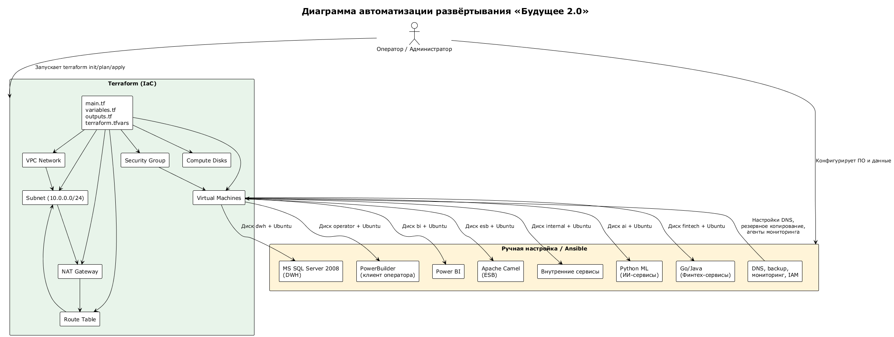
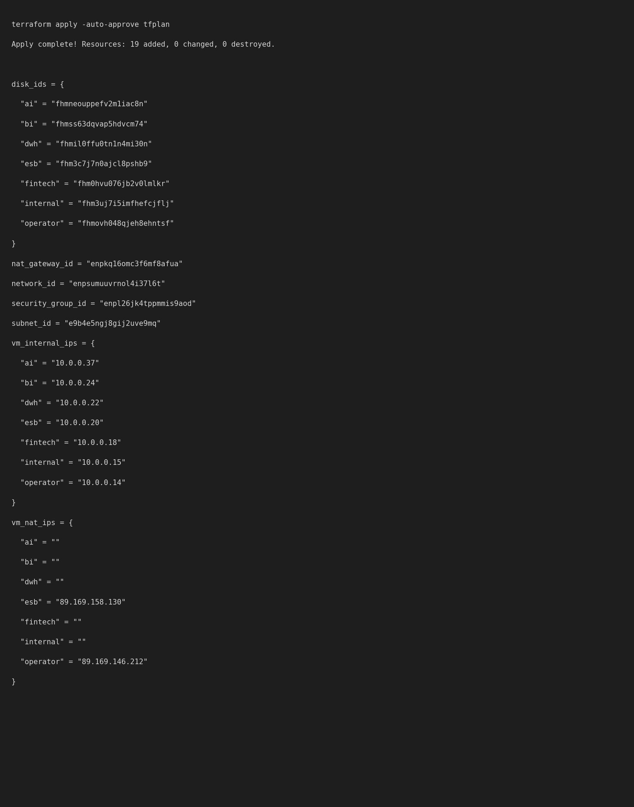

# Task 4. Облачная инфраструктура и Terraform

## Состав директории

| Файл | Назначение |
|------|------------|
| `main.tf` | Описание инфраструктуры: VPC, subnet, NAT, security group, диски и ВМ. |
| `variables.tf` | Определение входных переменных. |
| `outputs.tf` | Выходные параметры: ID сети, дисков, внутренние/внешние IP ВМ. |
| `terraform.tfvars` | Пример значений переменных (замените `<your-cloud-id>`, `<your-folder-id>` и путь к ключу). |
| `diagram.png` | Диаграмма автоматизации развёртывания. |
| `diagrams/automation-deployment.puml` | Исходник диаграммы. |
| `justification.md` | Обоснование выбора ресурсов и параметров. |
| `screenshots/terraform-apply.png` | Результат выполнения `terraform apply`. |
| `.gitignore` | Исключение Terraform-стейта и секретов из Git. |

## Диаграмма автоматизации развёртывания



На схеме зелёным выделены компоненты, управляемые Terraform (сеть, подсеть, NAT, диски, ВМ). Жёлтым — то, что настраивается вручную или через Ansible (установка ПО, данные, DNS, backup, IAM).

## Как запустить

1. Подготовьте сервисный ключ Yandex Cloud (JSON-файл) и заполните `terraform.tfvars`.
2. Выполните:
   ```bash
   terraform init
   terraform plan -out=tfplan
   terraform apply -auto-approve tfplan
   ```
3. После проверки не забудьте удалить ресурсы:
   ```bash
   terraform destroy -auto-approve
   ```

## Результат apply



Создано 19 ресурсов: VPC, subnet, NAT-шлюз, таблица маршрутов, security group, 7 дисков и 7 виртуальных машин.
